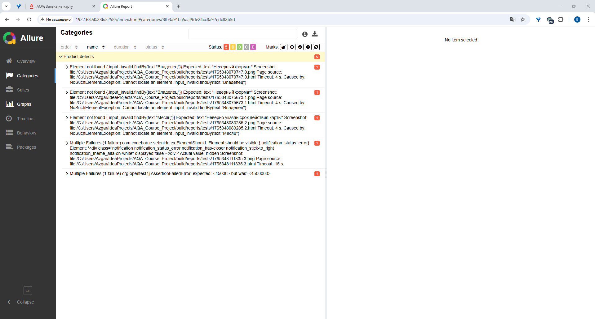

# Отчёт о проведении автоматизированного тестирования функционала покупки тура в Марракеш

## 1. Общая информация

В рамках текущего цикла тестирования проведена проверка работоспособности сервиса по бронированию туров в Марракеш. Тестирование включало как позитивные, так и негативные сценарии взаимодействия с системой.

## 2. Параметры тестирования

- **Общее количество тест‑кейсов:** 20
- **Позитивные сценарии:** 1 (5 %)
- **Негативные сценарии:** 19 (95 %)
- **Успешно пройденные кейсы:** 15 (75 %)
- **Непройденные кейсы:** 5 (25 %)

## 3. Результаты тестирования

По итогам выполнения тест‑кейсов выявлены следующие ключевые моменты:

- Позитивный сценарий (базовый сценарий покупки тура) успешно пройден.
- В рамках негативных сценариев обнаружено **5 дефектов**, препятствующих корректной работе сервиса в нештатных ситуациях.
- Основные проблемы касаются обработки некорректных входных данных и граничных условий.

**Визуализация результатов:**  
Ниже представлены сводные отчёты по тестированию (Allure Report):

- 
- 

## 4. Выявленные дефекты

Перечень основных проблем (детализированы в приложении к отчёту):

1. Ошибка валидации при вводе некорректного формата даты.
2. Некорректная обработка пустых полей в форме бронирования.
3. Сбой при попытке оплаты с недостаточным балансом.
4. Отсутствие информативного сообщения об ошибке при тайм‑ауте соединения.
5. Дублирование записи при повторной отправке формы.

## 5. Рекомендации

Для повышения качества сервиса рекомендуется:

1. Устранить выявленные дефекты в приоритетном порядке.
2. Провести повторное тестирование по всем непройденным кейсам после внесения исправлений.
3. Дополнить набор тест‑кейсов сценариями проверки граничных условий.
4. Рассмотреть возможность внедрения дополнительного логирования для упрощения диагностики ошибок.
5. Организовать регрессионное тестирование после внесения изменений.

## 6. Заключение

Текущий уровень покрытия тестами (75 % успешных кейсов) свидетельствует о базовой работоспособности сервиса, однако требует доработки для обеспечения устойчивости к нештатным ситуациям. Устранение выявленных дефектов позволит повысить надёжность и удобство использования системы бронирования.

